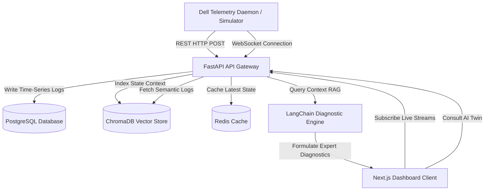

# Dell AI Digital Twin for Laptop Telemetry

An enterprise-ready **AI Digital Twin** system designed to monitor, simulate, and analyze Dell laptop telemetry data. By collecting granular, real-time performance indicators (CPU, RAM, thermals, fans, and battery health) and leveraging a **Retrieval-Augmented Generation (RAG)** pipeline, this application creates a virtual model of the device ("Digital Twin") that can be interrogated for automated troubleshooting and predictive diagnostics.

## System Architecture

The project is designed using a decoupled service architecture composed of five primary containers coordinated via Docker Compose:



---

## Product Modules & Workspaces

The platform is structured into two main workspaces, selected from a landing page:

### 1. Historical Telemetry Intelligence
*   **Purpose**: Deep-dive analytics of uploaded datasets and past system logs to resolve "What happened?" and "Why did it happen?".
*   **Features**: CSV uploads, Recharts trend lines, Pearson/Spearman correlation heatmaps, dynamic influence graphs, heuristic decision tree root-cause analysis, and Neo4j knowledge graph exploration.
*   **Historical Chatbot**: A data-isolated chatbot that only answers queries grounded in historical logs/databases, refusing predictions or simulation queries.

### 2. Live AI Digital Twin
*   **Purpose**: Real-time laptop monitoring, forecast horizons, and physics-based what-if simulations to answer "What is happening now?", "What will happen?", and "What could happen?".
*   **Tabbed Interface**:
    *   **Current State**: Live parameters dashboard, 3D laptop thermal/battery mapping (Three.js), and fleet view cards.
    *   **Prediction**: LSTM battery discharge curves, Prophet signal degradation timelines, and XGBoost CPU/GPU temperature predictions.
    *   **What-If Simulation**: Steady-state power/thermal calculations with sliders and branch overlays.
*   **Live Chatbot**: A data-isolated chatbot answering strictly from live telemetry, current health score, forecasts, and simulations, refusing historical database queries.

---

## Tech Stack
- **Frontend Presentation**: [Next.js 14](https://nextjs.org/) (App Router, TypeScript, Tailwind CSS, Recharts)
- **API Engine**: [FastAPI](https://fastapi.tiangolo.com/) (Async ASGI, WebSockets, Structured Logging, API v1 Versioning)
- **Primary Data Store**: [PostgreSQL](https://www.postgresql.org/) (SQLAlchemy ORM)
- **In-Memory Cache**: [Redis](https://redis.io/)
- **Vector Core**: [ChromaDB](https://www.trychroma.com/) (Semantic Log Storage)
- **AI Orchestrator**: [LangChain](https://www.langchain.com/) (RAG Diagnostic Chain)
- **Orchestration**: [Docker Compose](https://docs.docker.com/compose/)

---

## Directory Structure

```
telemetry-digital-twin/
├── docker-compose.yml       # Production-ready compose configuration
├── .env                     # Local environment file
├── .env.example             # Environment configuration template
├── README.md                # System documentation
├── CHANGELOG.md             # Automated project change tracking
├── PROJECT_STATUS.md        # Active project phase board
├── backend/                 # FastAPI API backend
│   ├── Dockerfile           # Multi-stage python runner
│   ├── requirements.txt     # Backend python dependencies
│   └── app/
│       ├── main.py          # FastAPI application router setup
│       ├── core/
│       │   ├── config.py    # Pydantic Settings
│       │   ├── database.py  # SQLAlchemy engine pool
│       │   └── logging.py   # Custom structured logger
│       ├── models/
│       │   └── telemetry.py # Telemetry DB schemas
│       ├── schemas/
│       │   └── telemetry.py # Pydantic API validation
│       ├── api/
│       │   └── v1/
│       │       ├── router.py     # Endpoint router mapping
│       │       ├── telemetry.py  # Telemetry stream REST & WebSocket endpoints
│       │       └── twin.py       # AI Digital Twin consultation routes
│       └── services/
│           └── langchain_twin.py # LangChain Chroma RAG diagnostic service
└── frontend/                # Next.js frontend SPA
    ├── Dockerfile           # Client node development container
    ├── package.json         # Client dependencies
    ├── tsconfig.json        # TypeScript compiler rules
    ├── tailwind.config.ts   # Design theme system variables
    ├── postcss.config.js    
    ├── next.config.js       
    └── src/
        ├── types/
        │   └── index.ts     # Common interfaces
        └── app/
            ├── globals.css  # Global styles and tailwind directives
            ├── layout.tsx   # Base app page layout shell
            └── page.tsx     # Live Telemetry and AI Chat panel
```

---

## Git Workflow and Branching Strategy

This project follows a strict branching standard to ensure production-grade traceability:

*   `main`: Represents production-ready releases.
*   `develop`: The integration branch for active features.
*   `feature/*`: Branches isolated for specific functionality (e.g. `feature/telemetry-ingestion`).

All commit messages adhere to standard semantic conventions:
- `feat: add telemetry ingestion service`
- `fix: resolve dashboard rendering issue`
- `docs: update architecture documentation`

---

## Getting Started

### Local Setup (Standalone Docker Compose)

1. Ensure **Docker Desktop** is running.
2. Initialize environment:
   ```bash
   cp .env.example .env
   ```
3. Run the system:
   ```bash
   docker compose up --build -d
   ```
4. Access portals:
   - **Frontend UI Console**: [http://localhost:3000](http://localhost:3000)
   - **Interactive API Swagger Docs**: [http://localhost:8000/docs](http://localhost:8000/docs)
   - **API Health Check**: [http://localhost:8000/api/v1/health](http://localhost:8000/api/v1/health)
